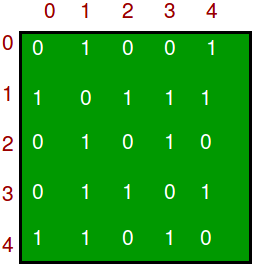
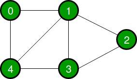
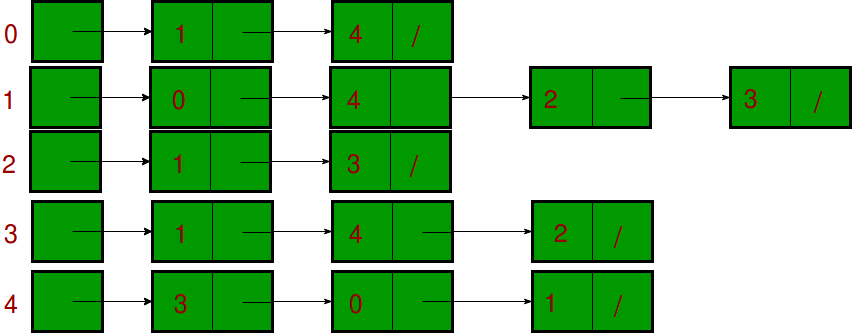

# C++ Data Structures and Algorithms

## Table of Contents

<!-- TOC depthFrom:1 depthTo:6 withLinks:1 updateOnSave:1 orderedList:0 -->

- [C++ Data Structures and Algorithms](#c-data-structures-and-algorithms)
  
  - [Table of Contents](#table-of-contents)
  
  - [1.0 Data Structures](#10-data-structures)
    
    - [1.1 Overview](#11-overview)
    - [1.2 Vector `std::vector`](#12-vector-stdvector)
    - [1.3 Deque `std::deque`](#13-deque-stddeque)
    - [1.4 List `std::list` and `std::forward_list`](#14-list-stdlist-and-stdforward_list)
    - [1.5 Map `std::map` and `std::unordered_map`(Hash table)](#15-map-stdmap-and-stdunordered_map-hash-table)
    - [1.6 Set `std::set`](#16-set-stdset)
    - [1.7 Stack `std::stack`](#17-stack-stdstack)
    - [1.8 Queue `std::queue`](#18-queue-stdqueue)
    - [1.9 Priority Queue `std::priority_queue`](#19-priority-queue-stdpriority_queue)
    - [1.10 Heap `std::priority_queue`](#110-heap-stdpriority_queue)
  
  - [2.0 Trees](#20-trees)
    
    - [2.1 Binary Tree](#21-binary-tree)
    - [2.2 Balanced Trees](#22-balanced-trees)
    - [2.3 Binary Search](#23-binary-search)
    - [2.4 Depth-First Search](#24-depth-first-search)
    - [2.5 Breadth-First Search](#25-breadth-first-search)
  
  - [3.0 Graphs](#30-graphs)
    
    - [3.1 Graph representation](#31-graph-representation)
    - [3.2 Depth First Search (DFS Cycle)](#32-depth-first-search-dfs-cycle)
    - [3.3 Breadth First Search (BDS)](#33-breadth-first-search-bds)
    - [3.4 Dijkstra shortest path algorithm](#34-dijkstra-shortest-path-algorithm)
    - [3.5 Dijkstra shortest path algorithm improved](#35-dijkstra-shortest-path-algorithm-improved)
  
  - [4.0 Algorithms](#40-algorithms)
    
    - [4.1 Insertion Sort](#41-insertion-sort)
    - [4.2 Selection Sort](#42-selection-sort)
    - [4.3 Bubble Sort](#43-bubble-sort)
    - [4.4 Merge Sort](#44-merge-sort)
    - [4.5 Quicksort](#45-quicksort)
    - [4.6 Partial Quicksort (find k smallest)](#46-partial-quicksort-find-k-smallest)
    - [4.7 Shift Array left (Juggling Algorithm)](#47-shift-array-left-juggling-algorithm)
    - [4.8 Longest Common Subsequence (DP)](#48-longest-common-subsequence-dp)
    - [4.9 Max sub set sum](#49-max-sub-set-sum)
    - [4.10 Check strings equal (can remove lower case and change to upper)](#410-check-strings-equal-can-remove-lower-case-and-change-to-upper)
    - [4.11 Count geometric progression triplets](#411-count-geometric-progression-triplets)
    - [4.12 Count minimum num of swaps to sort array](#412-count-minimum-num-of-swaps-to-sort-array)
  
  - [5.0 Libraries](#50-libraries)
    
    - [5.1 `cstdint` `climits` `cfloat`](#51-cstdint-climits-cfloat)
    - [5.1 `algorithm`](#52-algorithm)

<!-- /TOC -->

## 1.0 Data Structures

### 1.1 Overview


-------------------------------------------------------

### 1.2 Vector `std::vector`

[top](#table-of-contents)

**Use for**

* Simple storage

* Adding but not deleting

* Serialization

* Quick lookups by index

* Easy conversion to C-style arrays

* Efficient traversal (contiguous CPU caching)

**Do not use for**

* Insertion/deletion in the middle of the list
* Dynamically changing storage
* Non-integer indexing

**Time Complexity**

| Operation    | Time Complexity |
| ------------ | --------------- |
| Insert Head  | `O(n)`          |
| Insert Index | `O(n)`          |
| Insert Tail  | `O(1)`          |
| Remove Head  | `O(n)`          |
| Remove Index | `O(n)`          |
| Remove Tail  | `O(1)`          |
| Find Index   | `O(1)`          |
| Find Object  | `O(n)`          |

**Example Code**

```c++
#include <vector>
using namespace std;

vector<int> v;

//---------------------------------
// General Operations
//---------------------------------

// Insert head, index, tail
v.insert(v.begin(), value);             // head
v.insert(v.begin() + index, value);     // index
v.push_back(value);                     // tail

// Access head, index, tail
int head = v.front();       // head
int value = v.at(index);    // index
int tail = v.back();        // tail

// Size
unsigned int size = v.size();

// Iterate
for(vector<int>::iterator it = v.begin(); it != v.end(); it++) {
    cout << *it << endl;
}

// Remove head, index, tail
v.erase(v.begin());             // head
v.erase(v.begin() + index);     // index
v.pop_back();                   // tail

// Clear
v.clear();

#include <iostream>
#include <vector>

int main()
{
    // Create a vector containing integers
    vector<int> v = {7, 5, 16, 8};
    int length = 10;
    vector<int> v1(length,0); // vector containing 10 zeros
    // Add two 25 to vector
    v.push_back(25);

    // Iterate and print values of vector
    for(int n : v) {
        cout << n << '\n';
    }
}
```

-------------------------------------------------------

### 1.3 Deque `std::deque`

[top](#table-of-contents)

**Use for**

* Similar purpose of `std::vector`
* Basically `std::vector` with efficient `push_front` and `pop_front`

**Do not use for**

* C-style contiguous storage (not guaranteed)

**Notes**

* Pronounced 'deck'
* Stands for **D**ouble **E**nded **Que**ue

**Example Code**

```c++
#include <deque>
using namespace std;

deque<int> d;

//---------------------------------
// General Operations
//---------------------------------

// Insert head, index, tail
d.push_front(value);                    // head
d.insert(d.begin() + index, value);     // index
d.push_back(value);                     // tail

// Access head, index, tail
int head = d.front();       // head
int value = d.at(index);    // index
int tail = d.back();        // tail

// Size
unsigned int size = d.size();

// Iterate
for(deque<int>::iterator it = d.begin(); it != d.end(); it++) {
    cout << *it << endl;
}

// Remove head, index, tail
d.pop_front();                  // head
d.erase(d.begin() + index);     // index
d.pop_back();                   // tail

// Clear
d.clear();

int main ()
{
  // constructors used in the same order as described above:
  deque<int> first;                                // empty deque of ints
  deque<int> second (4,100);                       // four ints with value 100
  deque<int> third (second.begin(),second.end());  // iterating through second
  deque<int> fourth (third);                       // a copy of third

  // the iterator constructor can be used to copy arrays:
  int myints[] = {16,2,77,29};
  deque<int> fifth (myints, myints + sizeof(myints) / sizeof(int) );

  cout << "The contents of fifth are:";
  for (deque<int>::iterator it = fifth.begin(); it!=fifth.end(); ++it)
    cout << ' ' << *it;
}
```

-------------------------------------------------------

### 1.4 List `std::list` and `std::forward_list`

[top](#table-of-contents)

**Use for**

* Insertion into the middle/beginning of the list
* Efficient sorting (pointer swap vs. copying)

**Do not use for**

* Direct access

**Time Complexity**

| Operation    | Time Complexity |
| ------------ | --------------- |
| Insert Head  | `O(1)`          |
| Insert Index | `O(n)`          |
| Insert Tail  | `O(1)`          |
| Remove Head  | `O(1)`          |
| Remove Index | `O(n)`          |
| Remove Tail  | `O(1)`          |
| Find Index   | `O(n)`          |
| Find Object  | `O(n)`          |

**Example Code**

```c++
#include <list>
using namespace std;

list<int> l;

//---------------------------------
// General Operations
//---------------------------------

// Insert head, index, tail
l.push_front(value);                    // head
l.insert(l.begin() + index, value);     // index
l.push_back(value);                     // tail

// Access head, index, tail
int head = l.front();                                           // head
int value = next(l.begin(), index);                // index
int tail = l.back();                                            // tail

// Size
unsigned int size = l.size();

// Iterate
for(list<int>::iterator it = l.begin(); it != l.end(); it++) {
    cout << *it << endl;
}

// Remove head, index, tail
l.pop_front();                  // head
l.erase(l.begin() + index);     // index
l.pop_back();                   // tail

// Clear
l.clear();

//---------------------------------
// Container-Specific Operations
//---------------------------------

// Splice: Transfer elements from list to list
//    splice(iterator pos, list &x)
//      splice(iterator pos, list &x, iterator i)
//      splice(iterator pos, list &x, iterator first, iterator last)
l.splice(l.begin() + index, list2);

// Remove: Remove an element by value
l.remove(value);

// Unique: Remove duplicates
l.unique();

// Merge: Merge two sorted lists
l.merge(list2);

// Sort: Sort the list
l.sort();

// Reverse: Reverse the list order
l.reverse();

int main ()
{
  // constructors used in the same order as described above:
  list<int> first;                                // empty list of ints
  list<int> second (4,100);                       // four ints with value 100
  list<int> third (second.begin(),second.end());  // iterating through second
  list<int> fourth (third);                       // a copy of third

  // the iterator constructor can also be used to construct from arrays:
  int myints[] = {16,2,77,29};
  list<int> fifth (myints, myints + sizeof(myints) / sizeof(int) );

  cout << "The contents of fifth are: ";
  for (list<int>::iterator it = fifth.begin(); it != fifth.end(); it++)
    cout << *it << ' ';

}
```

-------------------------------------------------------

### 1.5 Map `std::map` and `std::unordered_map` Hash table

[top](#table-of-contents)

**Use for**

* Key-value pairs
* Constant lookups by key
* Searching if key/value exists
* Removing duplicates
* `std::map`
  * Ordered map
* `std::unordered_map`
  * **Hash table**

**Do not use for**

* Sorting

**Notes**

* Typically ordered maps (`std::map`) are slower than unordered maps (`std::unordered_map`)
* Maps are typically implemented as *binary search trees*

**Time Complexity**

**`std::map`**

| Operation         | Time Complexity |
| ----------------- | --------------- |
| Insert            | `O(log(n))`     |
| Access by Key     | `O(log(n))`     |
| Remove by Key     | `O(log(n))`     |
| Find/Remove Value | `O(log(n))`     |

**`std::unordered_map`**

| Operation         | Time Complexity |
| ----------------- | --------------- |
| Insert            | `O(1)`          |
| Access by Key     | `O(1)`          |
| Remove by Key     | `O(1)`          |
| Find/Remove Value | --              |

**Example Code**

```c++
include <map>
using namespace std;

map<string, string> m;

//---------------------------------
// General Operations
//---------------------------------

// Insert
m.insert(pair<string, string>("key", "value"));

// Access by key
string value = m.at("key");

// Size
unsigned int size = m.size();

// Iterate
for(map<string, string>::iterator it = m.begin(); it != m.end(); it++) {
    cout << *it << endl;
}

// Remove by key
m.erase("key");

// Clear
m.clear();

//---------------------------------
// Container-Specific Operations
//---------------------------------

// Find if an element exists by key
bool exists = (m.find("key") != m.end());

// Count the number of elements with a certain key
unsigned int count = m.count("key");

#include <iostream>
#include <string>
#include <unordered_map>

int main()
{
    // Create an unordered_map of three strings (that map to strings)
    unordered_map<string, string> u = {
        {"RED","#FF0000"},
        {"GREEN","#00FF00"},
        {"BLUE","#0000FF"}
    };

    // Iterate and print keys and values of unordered_map
    for( const auto& n : u ) {
        cout << "Key:[" << n.first << "] Value:[" << n.second << "]\n";
    }

    // Add two new entries to the unordered_map
    u["BLACK"] = "#000000";
    u["WHITE"] = "#FFFFFF";

    // Output values by key
    cout << "The HEX of color RED is:[" << u["RED"] << "]\n";
    cout << "The HEX of color BLACK is:[" << u["BLACK"] << "]\n";

    // Find if an element exists by key
    bool exists = (u.count("BLACK") != 0);
    bool exists = (u.find("BLACK") != m.end());

    // remove element
    u.erase ( "BLACK" );  // Remove by key "BLACK"
    u.erase ( u.find("BLUE"), u.end() ); // eras efrom blue to the end

    return 0;
}
```

-------------------------------------------------------

### 1.6 Set `std::set`

[top](#table-of-contents)

**Use for**

* Removing duplicates
* Ordered dynamic storage

**Do not use for**

* Simple storage
* Direct access by index

**Notes**

* Sets are often implemented with binary search trees

**Time Complexity**

| Operation | Time Complexity |
| --------- | --------------- |
| Insert    | `O(log(n))`     |
| Remove    | `O(log(n))`     |
| Find      | `O(log(n))`     |

**Example Code**

```c++
include <set>
using namespace std;

set<int> s;

//---------------------------------
// General Operations
//---------------------------------

// Insert
s.insert(20);

// Size
unsigned int size = s.size();

// Iterate
for(set<int>::iterator it = s.begin(); it != s.end(); it++) {
    cout << *it << endl;
}

// Remove
s.erase(20);

// Clear
s.clear();

//---------------------------------
// Container-Specific Operations
//---------------------------------

// Find if an element exists
bool exists = (s.find(20) != s.end());

// Count the number of elements with a certain value
unsigned int count = s.count(20);


int main ()
{
  set<int> first;                           // empty set of ints
  int myints[]= {10,20,30,40,50};
  set<int> second (myints,myints+5);        // range
  set<int> third (second);                  // a copy of second
  set<int> fourth (second.begin(), second.end());  // iterator ctor.
}
```

-------------------------------------------------------

### 1.7 Stack `std::stack`

[top](#table-of-contents)

**Use for**

* First-In Last-Out operations
* Reversal of elements

**Time Complexity**

| Operation | Time Complexity |
| --------- | --------------- |
| Push      | `O(1)`          |
| Pop       | `O(1)`          |
| Top       | `O(1)`          |

**Example Code**

```c++
include <stack>
using namespace std;

stack<int> s;

//---------------------------------
// Container-Specific Operations
//---------------------------------

// Push
s.push(20);

// Size
unsigned int size = s.size();

// Pop
s.pop();

// Top
int top = s.top();
```

-------------------------------------------------------

### 1.8 Queue `std::queue`

[top](#table-of-contents)

**Use for**

* First-In First-Out operations
* Ex: Simple online ordering system (first come first served)
* Ex: Semaphore queue handling
* Ex: CPU scheduling (FCFS)

**Notes**

* Often implemented as a `std::deque`

**Example Code**

```c++
include <queue>
queue<int> q;

//---------------------------------
// General Operations
//---------------------------------

// Insert
q.push(value);

// Access head, tail
int head = q.front();       // head
int tail = q.back();        // tail

// Size
unsigned int size = q.size();

// Remove
q.pop();
```

-------------------------------------------------------

### 1.9 Priority Queue `std::priority_queue`

[top](#table-of-contents)

**Use for**

* First-In First-Out operations where **priority** overrides arrival time
* Ex: CPU scheduling (smallest job first, system/user priority)
* Ex: Medical emergencies (gunshot wound vs. broken arm)

**Notes**

* Often implemented as a `std::vector`

**Example Code**

```c++
#include <queue>
using namespace std;
priority_queue<int> p;

//---------------------------------
// General Operations
//---------------------------------

// Insert
p.push(value);

// Access
int top = p.top();  // 'Top' element

// Size
unsigned int size = p.size();

// Remove
p.pop();

#include <queue>
#include <vector>
#include <iostream>
using namespace std;

int main() {
    priority_queue<int> q;

    for(int n : {1,8,5,6,3,4,0,9,7,2})
        q.push(n);

    cout << "first element decending (default): " << q.top() << endl;

    priority_queue<int, vector<int>, greater<int> > q2;

    for(int n : {1,8,5,6,3,4,0,9,7,2})
        q2.push(n);

    cout << "first element ascending: " << q2.top() << endl; 
}
```

-------------------------------------------------------

### 1.10 Heap `std::priority_queue`

[top](#table-of-contents)

**Notes**

* A heap is essentially an instance of a priority queue
* A **min** heap is structured with the root node as the smallest and each child subsequently larger than its parent
* A **max** heap is structured with the root node as the largest and each child subsequently smaller than its parent
* A min heap could be used for *Smallest Job First* CPU Scheduling
* A max heap could be used for *Priority* CPU Scheduling

**Max Heap Example (using a binary tree)**


------------------------------------------------------

## 2.0 Trees

### 2.1 Binary Tree

[top](#table-of-contents)

* A binary tree is a tree with at most two (2) child nodes per parent
* Binary trees are commonly used for implementing `O(log(n))` operations for ordered maps, sets, heaps, and binary search trees
* Binary trees are **sorted** in that nodes with values greater than their parents are inserted to the **right**, while nodes with values less than their parents are inserted to the **left**

**Binary Search Tree**


-------------------------------------------------------

### 2.2 Balanced Trees

[top](#table-of-contents)

* A non-empty binary search tree is be balanced if:
  
  1. Its left subtree is balanced.
  2. Its Right subtree is balanced.
  3. The difference between heights of left and right subtree is less than or equal to  1

* Balanced trees ensure complexity of `O(log(n))` of basic opearation (Search, Insetrt Delete)

* Check if tree is balanced
  
  * [**Cpp** Basic implementation](cppCode/tree/check_tree_is_balanced_basic.cpp)
  * [**Cpp** improved implementation](cppCode/tree/check_tree_is_balanced_improved.cpp)
  * [**C** Basic implementation](cCode/check_tree_is_balanced_basic.c)
  * [**C** improved implementation](cCode/check_tree_is_balanced_improved.c)

* Examples of balanced trees:
  
  * AVL Trees - I think shortcut comes from names of inventors because it was the first such data structure to be invented. It keeps balance by recording `balance factors` (-2-2) -1 to 1 is good -2 and 2 requires tree rotation
  
  * Red-Black Trees - Each node of the binary tree has an extra bit (red or black)  These color bits are used to ensure the tree remains **approximately** balanced during insertions and deletions. Compared to AVL better for lot of inserts but wores for searches. How it keeps balance:
    
    1. Every node has a color either red or black.
    2. Root of tree is always black.
       3.There are no two adjacent red nodes (A red node cannot have a red parent or red child).
    3. Every path from a node (including root) to any of its descendant NULL node has the same number of black nodes.

-------------------------------------------------------

### 2.3 Binary Search

[top](#table-of-contents)

- [Iterative implementation](cppCode/binary_search_iterative.cpp)

- [Recursive implementation](cppCode/binary_search_recursive.cpp)

**Idea:**

1. If current element, return
2. If less than current element, look left
3. If more than current element, look right
4. Repeat

**Data Structures:**

* Tree
* Sorted array

**Space:**

* `O(1)`

**Best Case:**

* `O(1)`

**Worst Case:**

* `O(log n)`

**Average:**

* `O(log n)`

**Visualization:**


```c++
#include <algorithm>
#include <iostream>

using namespace std;

int main() 
{
    int a[] = { 1, 5, 8, 9, 6, 7, 3, 4, 2, 0 };
    int asize = sizeof(a) / sizeof(a[0]);
    sort(a, a + asize);
    if (binary_search(a, a + asize, 2))
        cout << "Element found in the array\n";
    else
        cout << "Element not found in the array\n";
    return 0;
}
```

-------------------------------------------------------

### 2.4 Depth-First Search

[top](#table-of-contents)

**Idea:**

1. Start at root node
2. **Recursively** search all adjacent nodes and mark them as searched
3. Repeat

**Space:**

* `O(h)` where h is maximum height of Binary Tree

**Performance:**

* `O(E)`, `E = number of edges`

**Pro**

* Visits leaves first (most important)
* better for balanced tree (memory)

**Con**

* worse for **not** balanced tree (memory)
* root is visited last
* Recursive

**Visualization:**


-------------------------------------------------------

### 2.5 Breadth-First Search

[top](#table-of-contents)
(Or Level Order Traversal)
**Idea:**

1. Start at root node
2. Search neighboring nodes first before moving on to next level

**Space:**

* `O(w)`  where w is maximum width of Binary Tree

**Performance:**

* `O(E)`, `E = number of edges`

**Pro**

* Visits top nodes first (most important)
* better for **not** balanced tree (less memory)
* Not recursive

**Con**

* worse for balanced tree
* leaves are visited last 

**Visualization:**


-------------------------------------------------------

## 3.0 Graphs

Graph is a data structure that consists of following two components:

1. A set of **vertices** also called as **nodes**.
2. A set of ordered edges, (u, v) is not same as (v, u). The edges may contain weight/value/cost.

Graphs are used to represent many real-life applications: 

* Graphs are used to represent networks. 
* social networks like linkedIn, Facebook.

### 3.1 Graph representation

[top](#table-of-contents)

1. **Adjacency Matrix** stores edges in 2D array of size V x V where V is the number of vertices in a graph. Let the 2D array be adj[][], a slot adj[i][j] = 1 indicates that there is an edge from vertex i to vertex j.
   * For undirected graph is always symmetric. 
   * Can be used to represent weighted graphs (adj[i][j] = w edge from vertex i to vertex j with weight w).
   * **Pros:** Removing/adding an edge takes **O(1)** time. check if there is edge from vertex ‘u’ to vertex ‘v’ take **O(1)**.
   * **Cons:** Always consumes more space **O(V^2)**

  

2. **Adjacency List** - Uses an array of lists. Size of the array is equal to the number of vertices. 
   * An entry array[i] represents the list of vertices adjacent to the ith vertex.
   * To represent weights edges can be represented as lists of pairs.

  

```c++
#include<iostream> 
#include <list> 
using namespace std; 

// This class represents a directed graph using 
// adjacency list representation 
class Graph 
{ 
    int numVer;    // No. of vertices 
    // Pointer to an array containing adjacency lists 
    list<int> *adj;    
public: 
    Graph(int numVer);  // Constructor 

    // function to add an edge to graph 
    void addEdge(int fromNum, int toNum);  

}; 

Graph::Graph(int numVer) 
{ 
    this->numVer = numVer; 
    adj = new list<int>[numVer]; 
} 

void Graph::addEdge(int fromNum, int toNum) 
{ 
    adj[fromNum].push_back(toNum); // Add w to v’s list. 
} 
```

### 3.2 Depth First Search (DFS Cycle)

[top](#table-of-contents)

* [**recursive_implementation**](cppCode/graph/DFS_Depth_First_Search.cpp)

Can be used to find cycles in the graph just stop when you try to visit already visited node 

**Idea:**

1. Start at root node
2. **Recursively** search all adjacent nodes and mark them as searched
3. Repeat

**Space:**

* `O(V)`, `V = number of verticies (Nodes)(Wierzchołek, poprostu ilosc elementow vertex)`

**Performance:**

* `O(E)`, `E = number of edges`

### 3.3 Breadth First Search (BDS)

[top](#table-of-contents)

* [**recursive_implementation**](cppCode/graph/BFS_Breadth_First _Search.cpp)

**Idea:**

1. Start at root node
2. Search neighboring nodes first before moving on to next level
3. avoid visited nodes

**Space:**

* `O(V)`, `V = number of verticies`

**Performance:**

* `O(E)`, `E = number of edges`

### 3.4 Dijkstra shortest path algorithm

[top](#table-of-contents)

* [**Simple Dijkstra**](cppCode/graph/Dijkstra_shortest_dist.cpp)

Given a graph and a source vertex in the graph, find shortest paths from source to all vertices in the given graph. (can be stopped when destiantion is reached)

**Idea:**

1. Create a set sptSet (shortest path tree set) that keeps track of nodes in shortest path tree, i.e., whose minimum distance from source is calculated and finalized. 
2. Initialize all distance values as INFINITE. Assign distance value as 0 for the source vertex so that it is picked first.
3. While sptSet doesn’t include all nodes(vertices)
   * Pick a node not in sptSet with minimum distance value from any node from sptSet
   * Include it to sptSet
   * repeat

**Space:**

* `O(V)`, `V = number of nodes(verticies)`

**Performance:**

* `O(V^2)`

### 3.5 Dijkstra shortest path algorithm improved

[top](#table-of-contents)

* [**Improved Dijkstra**](cppCode/graph/Dijkstra_shortest_dist_Improved.cpp)
  
  **Idea**
1. Create an empty priority_queue pq. Every item of pq is a pair (distance, node).
2. Initialize distances of all nodes as infinite.
3. Insert source node into pq and make its distance as 0.
4) While either pq doesn't become empty
   * Extract minimum distance node from pq. (u) 
   * Loop through all adjacent of minimum distance node and do following for every node v.
     If there is a shorter path to v through u 
     * Update distance of v, i.e., do dist[v] = dist[u] + weight(u, v)
     * Insert v into the pq (Even if v is already there)

**Space:**

* `O(V)`, `V = number of nodes(verticies)`

**Performance:**

* `O(ELogV)` E- edged, V- number of nodes

-------------------------------------------------------

## 4.0 Algorithms

### 4.1 Insertion Sort

[top](#table-of-contents)

* [**Cpp implementation**](cppCode/sort/insertion_sort.cpp)

#### Idea

1. Iterate over all elements

2. For each element:
   
   * Check if element is larger than largest value in sorted array

3. If larger: Move on

4. If smaller: Move item to correct position in sorted array
   
   #### Details
* **Data structure:** Array
* **Space:** `O(1)`
* **Best Case:** Already sorted, `O(n)`
* **Worst Case:** Reverse sorted, `O(n^2)`
* **Average:** `O(n^2)`

#### Advantages

* Easy to code
* Intuitive
* Better than selection sort and bubble sort for small data sets
* In insertion sort elements are bubbled into the sorted section and inner loop can be terminated early, while in bubble sort the maximums are bubbled out of the unsorted section. 
* Can sort in-place

#### Disadvantages

* Very inefficient for large datasets because n^2

#### Visualization


-------------------------------------------------------

### 4.2 Selection Sort

[top](#table-of-contents)

* [**Cpp implementation**](cppCode/sort/selection_sort.cpp)

#### Idea

1. Iterate over all elements
2. The selection sort algorithm sorts an array by repeatedly finding the minimum element (considering ascending order) from unsorted part and putting it at the beginning

#### Details

* **Data structure:** Array
* **Space:** `O(1)`
* **Best Case:** Already sorted, `O(n^2)`
* **Worst Case:** Reverse sorted, `O(n^2)`
* **Average:** `O(n^2)`

#### Advantages

* Simple
* Can sort in-place
* Low memory usage for small datasets
* Minimizes number of writes to memory 

#### Disadvantages

* Worse than bubble and insert because it cannot stop early (**best case O(n^2)**)
* Very inefficient for large datasets because n^2

#### Visualization


-------------------------------------------------------

### 4.3 Bubble Sort

[top](#table-of-contents)

* [**Cpp implementation**](cppCode/sort/bubble_sort.cpp)

#### Idea

1. Iterate over all elements
2. For each element:
   * Swap if current element is smaller than next one
3. After each iteration largest elemnt is at the end
4. Repeat until no swaps needed (detects already sorted array)

#### Details

* **Data structure:** Array
* **Space:** `O(1)`
* **Best Case:** Already sorted `O(n)`
* **Worst Case:** Reverse sorted, `O(n^2)`
* **Average:** `O(n^2)`

#### Advantages

* Easy to detect if list is sorted
* Can sort in place

#### Disadvantages

* Very inefficient for large datasets because n^2
* Much worse than insertion sort but better than bubble sort

#### Visualization


-------------------------------------------------------

### 4.4 Merge Sort

[top](#table-of-contents)

[**Cpp implementation**](cppCode/sort/merge_sort.cpp)

#### Idea

1. Divide list into smallest unit (1 element)
2. Compare each element with the adjacent list
3. Merge the two adjacent lists
4. Repeat

#### Details

* **Data structure:** Array
* **Space:** `O(n) auxiliary`
* **Best Case:** `O(nlog(n))`
* **Worst Case:** Reverse sorted, `O(nlog(n))`
* **Average:** `O(nlog(n))`

#### Advantages

* High efficiency on large datasets
* Nearly always O(nlog(n))
* Can be parallelized
* Better space complexity than standard Quicksort

#### Disadvantages

* Still requires O(n) extra space
* Slightly worse than Quicksort in some instances

#### Visualization


-------------------------------------------------------

### 4.5 Quicksort

[top](#table-of-contents)

* [**Cpp implementation**](cppCode/sort/quick_sort.cpp)

#### Idea

1. Choose a **pivot** from the array
2. Partition: Reorder the array so that all elements with values *less* than the pivot come before the pivot, and all values *greater* than the pivot come after
3. After that pivot is at correct place
4. Recursively apply the above steps to the sub-arrays

#### Details

* **Data structure:** Array
* **Space:** `O(1)`
* **Best Case:** `O(nlog(n))`
* **Worst Case:** All elements equal, `O(n^2)`
* **Average:** `O(nlog(n))`

#### Advantages

* Can sort in place
* Very quick and efficient with large datasets
* Can be parallelized
* Divide and conquer algorithm

#### Disadvantages

* Not stable (could swap equal elements)
* Worst case is worse than Merge Sort but average is **nlog(n)**

#### Optimizations

* Choice of pivot:
  * Choose median of the first, middle, and last elements as pivot
  * Counters worst-case complexity for already-sorted and reverse-sorted

#### Visualization


[top](#table-of-contents)

* [**Cpp implementation**](cppCode/sort/quick_sort_part.cpp)

#### Idea

 The same as quick sort but don't higher part when pivot is > `k` index to sort

1. Choose a **pivot** from the array

2. Partition: Reorder the array so that all elements with values *less* than the pivot come before the pivot, and all values *greater* than the pivot come after

3. After that pivot is at correct place

4. Recursively apply the above steps to the sub-arrays **when left is < k**
   
   #### Details
* **Data structure:** Array
* **Space:** `O(1)`
* **Worst Case:** All elements equal, `O(n^2)`
* **Average:** `O(n + k log k))`

#### Advantages

* Can sort in place
* Very quick and efficient with large datasets
* Can be parallelized
* Divide and conquer algorithm

### 4.7 Shift Array left (Juggling Algorithm)

[top](#table-of-contents)

* [**Cpp implementation**](cppCode/shift_array_left.cpp)

#### Idea

 Can by done easily in O(n) space this algorithm does it in place

1. divide the array in different sets where number of sets is equal to GCD(Greatest Common Divisor) of n and d 
2. move the elements within sets until you reach start point

#### Details

* **Data structure:** Array
* **Space:** `O(1)`
* **Time complexity:** `O(n)`

#### Advantages

* Can shift in place
* better time complexity than shifting by 1

#### Disadvantages

* O(n) space solution would be a bit faster

### 4.8 Longest Common Subsequence (DP)

[top](#table-of-contents)

* [**Naive Recursive Implementation**](cppCode/problems/longest_common_subseqence_recursive.cpp)
* [**Dynamic programming Implementation**](cppCode/problems/longest_common_subseqence_dyn_prog.cpp)

#### Idea

https://www.geeksforgeeks.org/longest-common-subsequence-dp-4/

given two sequences, find the length of longest subsequence present in both of them. A subsequence is a sequence that appears in the same relative order, but **not necessarily contiguous**. For example, “abc”, “abg”, “bdf”, “aeg”, ‘”acefg”, .. etc are subsequences of “abcdefg”.

1. Let the input sequences be X[0..m-1] and Y[0..n-1] of lengths m and n respectively. And let L(X[0..m-1], Y[0..n-1]) be the length of LCS of the two sequences.
2. If last characters of both sequences match (X[m-1] == Y[n-1]) then L(X[0..m-1], Y[0..n-1]) = 1 + L(X[0..m-2], Y[0..n-2])
3. If last characters of both sequences do not match (X[m-1] != Y[n-1]) then L(X[0..m-1], Y[0..n-1]) = MAX ( L(X[0..m-2], Y[0..n-1]), L(X[0..m-1], Y[0..n-2]) )
4. Above can be implemented recursive but this will cause to calculate the same subsequences multiple times can be imroved with dynamic programming
5. We need to declare 2d table L[m+1][n+1] and we buld it bottom up. L[i][j] contains length of LCS of X[0..i-1] and Y[0..j-1]

#### Details

* **Space Naive:** `O(1)`
* **Space DP:** `O(m*n)`
* **Time complexity Naive:** `O(2^n)`
* **Time complexity DP:** `O(m*n)`

### 4.9 Max sub set sum

[top](#table-of-contents)

* [**good implementation**](cppCode/problems/longest_common_subseqence_dyn_prog.cpp)

#### Idea

https://www.hackerrank.com/challenges/max-array-sum/

Given an array of integers, find the subset of non-adjacent elements with the maximum sum. Calculate the sum of that subset.

1. Naive implementation is to just calculate all sums and find max
2. Better just keep max prev and max prev prev
3. initialize maxPrevPrev = array[0] maxPrev = max(array[0], array[1])
4. iterate through table and calculate max = max(array[i], maxPrev, maxPrevPrev+array[i])
5. forget old maxPrevPrev: maxPrevPrev = maxPrev, maxPrev = max
6. result is max(maxPrevPrev, maxPrev)

#### Details

* **Space Naive:** `O(1)`
* **Space better:** `O(1)`
* **Time complexity Naive:** `O(n^2)`
* **Time complexity better:** `O(n)`

### 4.10 Check strings equal (can remove lower case and change to upper)

[top](#table-of-contents)

* [**Naive Implementation**](cppCode/problems/check_str_eq_rem_lowercase_or_toupper_naive.cpp)
* [**Dynamic programming Implementation**](cppCode/problems/check_str_eq_rem_lowercase_or_toupper_dyn_prog.cpp)

#### Idea

https://www.hackerrank.com/challenges/abbr/

You can perform the following operations on the string, Capitalize zero or more of lowercase letters delete all of the remaining lowercase letters in a string find out if after those operations string 1 can be equal to string 2

1. Naive could be recursion.
2. Use tabulation and dynamic programming
3. If last characters of both sequences match (X[m-1] == Y[n-1]) then L(X[0..m-1], Y[0..n-1]) = L(X[0..m-2], Y[0..n-2])
4. If last characters of X converted to upper and Y matches (touppper(X[m-1]) != Y[n-1] &&) then L(X[0..m-1], Y[0..n-1]) = ( L(X[0..m-2], Y[0..n-2]) or L(X[0..m-2], Y[0..n-1]) )
5. If last character of X lower case can be removed similar to point (3.) L(X[0..m-1], Y[0..n-1]) = L(X[0..m-2], Y[0..n-2])
6. If last character of X upper case cannot match L(X[0..m-1], Y[0..n-1]) = false 
7. Start table T[m+1][n+1] T[0][0] = true (two empty strings) T[0][i] = false T[j][0] = onlyLowerCase[X[0..j] (all has to be removed)

#### Details

* **Space Naive:** `O(1)`
* **Space dynamic programming:** `O(m*n)`
* **Time complexity Naive:** `O(2^n)`
* **Time complexity dynamic programming:** `O(m*n)`

### 4.11 Count geometric progression triplets

[top](#table-of-contents)

* [**Good Implementation**](cppCode/problems/triplet_geometric_progression.cpp)

#### Idea

https://www.hackerrank.com/challenges/count-triplets-1/problem

You are given an **sorted** array and you need to find number of tripets such that the elements are in geometric progression for a given common ratio r >=1

1. Naive just takes first number and tries to find second and third
2. Can be improved by using 2 hash tables and starting to record how many triplets we will have when x*r and x*r*r are found

#### Details

* **Space Naive:** `O(1)`
* **Space better:** `O(n)`
* **Time complexity Naive:** `O(2^n)`
* **Time complexity better:** `O(n)`

### 4.12 Count minimum num of swaps to sort array

[top](#table-of-contents)

* [**Good Implementation**](cppCode/problems/min_num_of_swaps.cpp)

#### Idea

https://www.hackerrank.com/challenges/minimum-swaps-2/problem

You are given an unordered array consisting of **consecutive integers** without any duplicates. You are allowed to swap any two elements. You need to find the minimum number of swaps required to sort the array in ascending order

1. Naive just do insert sort.
2. Because this are consecutive integers swapping is not needed because we already know that value is at wrong position

## 5.0 Libraries

### 5.1 `cstdint` `climits` `cfloat`

[top](#table-of-contents)

**cstdint**

Defines fixed length types and limits for those:
int32_t, uint32_t …
uint_fast32_t -fastest unsigned integer type with width of at least 32 bits
UINT_FAST32_MAX

**climits**

Defines limits for build-in integer types
INT_MIN, INT_MAX, ULONG_MAX (unsinged long)

**cfloat**

Defines limits for floating types
FLT_MAX(float max) DBL_MAX(double max)

### 5.2 `algorithm`

[top](#table-of-contents)

* sort(first_iterator, last_iterator) – To sort the given vector.
* partial_sort(first_iterator, middle_iterator, last_iterator) - Find X smallest elements (finds smallest elements which fit to the middle_iterator)
* reverse(first_iterator, last_iterator) – To reverse a vector.
* *max_element (first_iterator, last_iterator) – To find the maximum element of a vector (returns iterator!).
* *min_element (first_iterator, last_iterator) – To find the minimum element of a vector (returns iterator!).
* count(first_iterator, last_iterator,x) – To count the occurrences of x in vector.
* find(first_iterator, last_iterator, x) – Points to last address of vector ((name_of_vector).end()) if element is not present in vector. 
* binary_search(first_iterator, last_iterator, x) – Tests whether x exists in **sorted** vector or not.
* copy(first_Source_iterator, last_source_iterator, destination_iterator) – use instead of **memcpy** Copy data from source to destination 
* fill(first_iterator, last_iterator, valToFill)

```c++
#include <algorithm> 
#include <iostream> 
#include <vector> 

using namespace std;  
bool compFuncDec (int i,int j) { return (i>j); }

struct myclass {
  bool operator() (int i,int j) { return (i>j);}
} compObjectDec;

int main() 
{ 
    vector<int> vect{1, 5, 8, 9, 6, 6, 3, 4, 2, 0};
    int n = vect.size();

    // Sorting the Vector in Ascending order 
    sort(vect.begin(), vect.end()); 
    //0 1 2 3 4 5 6 6 8 9

    // decendig order 
    sort (vect.begin(), vect.end(), compFuncDec);
    sort (vect.begin(), vect.end(), compObjectDec);
    //9 8 6 6 5 4 3 2 1 0 

    // partial sorting
    partial_sort(vect.begin(),vect.begin()+4, vect.end());
    //0 1 2 3 9 8 6 6 5 4

    // Reversing the Vector 
    reverse(vect.begin(), vect.end()); 
    //4 5 6 6 8 9 3 2 1 0

    int max = *max_element(vect.begin(), vect.end()); 
    // 9

    int min = *min_element(vect.begin(), vect.end());
      // 0

    // Counts the occurrences of 6 from 1st to 
    // last element 
    count(vect.begin(), vect.end(), 6); 
    // 2

    // find() returns iterator to last address if 
    // element not present 
    bool found = find(vect.begin(), vect.end(),9) != vect.end();
    //ture

      // Binary search
    sort(vect.begin(), vect.end()); // vector needs to be sorted
    found = binary_search(vect.begin(), vect.end(), 9);
    //ture

    vector<int> destVect (n);
    // Copy data from vect to destVect vector using copy
    copy( vect.begin(), vect.end(), destVect.begin());
    // Set destVector to 0
    fill( destVect.begin(), destVect.end(), 0x00);


    return 0; 
} 
```
